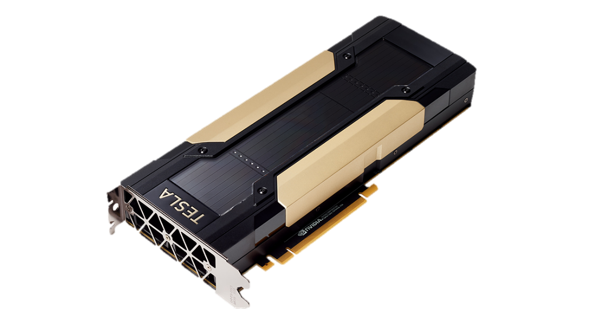

# 1.1 GPUとは
GPU(Graphic Processing Uint)とは、元々3Dレンダリング等の画像処理を高速に行うためのハードウェアで、Graphic BoardやVideo Cardとも呼ばれる。
高速な画像処理が必要なFPSゲームを買う際に「GPUの性能が…」と耳にするあのGPUである。

Tesla V100[[1]]

似たものにCPU(Central Processing Unit)がある。 
CPUもGPUもコンピューターが機能するために必要な計算処理を行うという点では同じだが、CPUは汎用的かつ複雑な処理、GPUは膨大な計算をまとめて処理することにそれぞれ特化している(ざっくり)。

GPUはCPUに対して独立したハードウェアである。
また、GPUは単体で動かすことが出来ず、GPUを動かすためのCPUが必要である。
従って、GPUを扱うためにはCPUとGPUの間でデータの転送を行う必要がある。

これまでGPUは主に映像出力用の画像処理をする際に用いられてきたが、昨今はその圧倒的な計算処理能力を、より汎用性のある目的のために使おうとする動きが出てきた。
そのために開発されたものがGPGPU(General Purpose GPU)である。GPGPUに対応しているGPUとしては、NVIDEA社製のGeForceシリーズが有名である。
GPGPUが用いられている分野としてはDeep Learning, 量子化学計算, 数値流体計算, 分子動力学計算, バイオ情報学等々、昨今のホットな話題が満載である[2]。
上のことを学びたい人はGPUを使った計算手法を学ぶ意義があると言えるだろう。

## Links
* [次へ](./1.2.md)
* [前へ](./1.0.md)
* [目次](./index.md)

## 引用、紹介
[[1]] [Tesla V100][1]

[2] 畝山多加志 『大規模並列数値計算特論 GPUプログラミング(1)』2019年度講義資料

[1]:https://www.nvidia.com/ja-jp/data-center/v100/