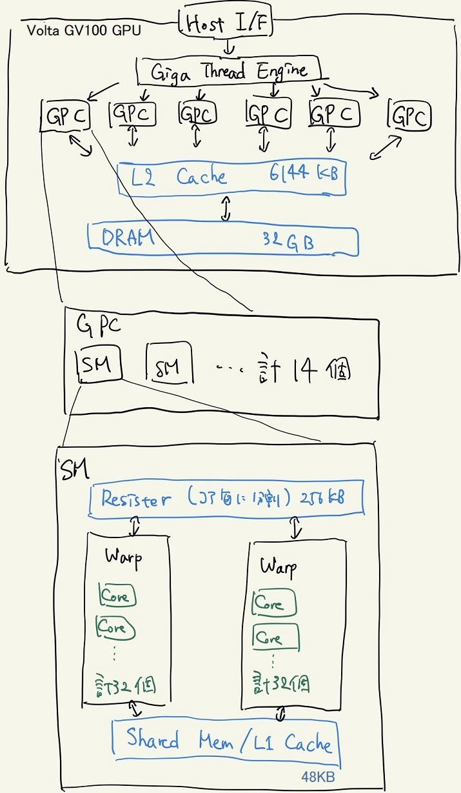

# 1.3 GPUの構造
## 1.3.1 GPUの構成
下図はTesla V100が搭載しているVolta GV100 GPUの構造の概略図である。

[[1]-[2]] Volta GV100の構造の概略図。昨今の一般的なGPUも似たような構造を取っている。

>* GPC(Graphics Processing Claster)
>* SM(Streaming Multiprocessor)

GPUで処理を行うためにはCPU側からデータを転送する必要があり、送られたデータはDRAMに格納される。DRAMはCPU側のメモリとPCIバスを通してDMA(Direct Memory Access)形式によってデータの交換を行う。
これは高々10GB/sec程度であり、GPUの処理性能と比較して「極めて」遅い。
したがって、頻繁にGPU-CPU間で処理性能に対して莫大なデータを転送する処理を行う場合、PCIバスの転送速度によって律速されてしまう点に注意する。
また、DMA形式の特徴として、指定するアドレスをスライドさせながら小刻みにデータを転送するよりも、一つのアドレスから連続した領域を転送する方が向いている( = データを転送する場合は指定するアドレスを少なくするほうが良い)[[3]]。

SMには複数のCUDA CoreとレジスタとSharedメモリがある。
同じSM内には同じ命令がCUDA Coreによってベクトル的に動作している。
CUDA Coreは32個毎のまとまりで同期的に動き、その一つの単位をWarpと呼ぶ。異なるWarp間の動作は非同期的である。
CUDA Coreは前述の通り、CPUのコアとは違い、ベクトル化された単純な処理を前提にして構成されており、分岐処理等の複雑な処理でパフォーマンスが落ちる点に注意する。

## 1.3.2 メモリの階層性
もともと、GPUは転送された入力に対して即座に出力・転送を行うストリーム型の処理(グラフィック処理のようにデータを再利用をしない処理)の用途に用いられていたので、CPUにあるようなメモリの階層性がなかった[[3]]。
しかし、汎用的な用途にGPUが用いられるようになるにつれて、DRAMへのアクセスが増えるようになった。
DRAMは安価で大容量であるもののアクセスに時間を要する、という特徴がある。
そこで、小容量であるもののアクセス速度が極めて速いキャッシュを搭載することで速度の向上化を図るようになった。
これがGPGPUのGeneral Purposeたる所以である。

GPUに内蔵されている様々メモリについて次のような特徴がある。

* DRAM: 大容量(数GB)、低速、全てのSMとアクセス
* L2キャッシュ: 中容量(数千KB)、中速、DRAMで再利用率の高いものが入る
* L1キャッシュ: 低容量(数十KB)、高速、同じSM内で共有
* レジスタ: 低容量(数十KB)、高速、Core毎に固有の領域を持つ

したがって、GPUで効率の良いプログラムを組む場合は、なるべくDRAMからデータをキャッシュに持ってきて、さらにキャッシュ上でデータを使い回すような組み方をすることが重要だ。

## 1.3.3 Tesla V100[[1]]
Tesla V100にはSMが80個(上の図では84個のように見えるが...? 参考資料[[1]]内で数が合わない←よくわからん)あり、そのSM1つあたりにInt型、Float32型の計算を行うコアが64個、Float64型の計算を行うコアが32個入っている。
従ってInt型、Float32型では計5120コア、Float64型では計2560コアの並列計算が可能である。

## 1.3.3 GPUに向いている処理
最後にGPUで行うべき処理をまとめておく。

* SIMD演算、ベクトル演算
* 分岐処理が少ない
* CPUとGPUの間の通信が少ない

## Links
* [次へ](./1.4.md)
* [前へ](./1.2.md)
* [目次](./index.md)

## 参考・紹介
[[1]] [NVIDIA TESLA V100 GPU アーキテクチャ -世界最先端のデータセンター GPU-][1]

[[2]] [NVIDIA Fermiのマルチスレッディングアーキテクチャ][2]

[[3]] [NVIDIA GPU の構造と CUDA スレッディングモデル][3]

[1]: https://www.google.com/url?sa=t&rct=j&q=&esrc=s&source=web&cd=&ved=2ahUKEwivl8j6trbqAhUQHXAKHYBoApYQFjAAegQIARAB&url=https%3A%2F%2Fimages.nvidia.com%2Fcontent%2Fpdf%2Ftesla%2FVolta-Architecture-Whitepaper-v1.1-jp.pdf&usg=AOvVaw1FEIMLYNBBt8Y6CLaN80Ta

[2]: https://pc.watch.impress.co.jp/docs/column/kaigai/326442.html

[3]: https://www.softek.co.jp/SPG/Pgi/TIPS/public/accel/gpu-accel2.html