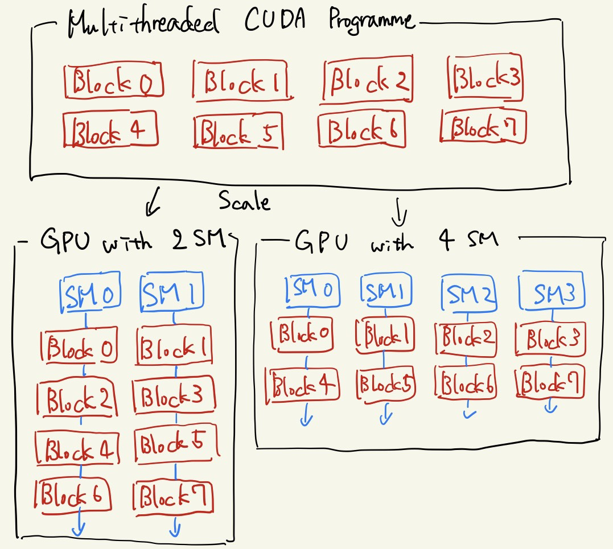

# 1.5 GPUとCUDAの関係
[前節](./1.4.md)にてCUDAはGPUの詳細な構造を隠蔽していると述べた。
この節ではCUDAからみるGPUの構造と実際のGPUがどのように対応つけられているか解説する。

※ただし、可能な限り調べたが、この節の話はあくまで私の見解である。

## 1.5.1 Automatic Scalability
まず、CUDAのブロックとGPUのSM間対応について述べる。
基本的に、分割されたブロック単位の処理群はGPU内のそれぞれのSMにて処理される。
一方で、ブロック数の上限値は(x, y, z): (2147483647, 65535, 65535)なのに対し、サーバー用途のTesla V100といえど、SMの数は80である。
CUDAは両者の間を次のように埋めている。

8つのブロックで並列化されたCUDAプログラムをそれより少ないSMしかもたないGPUで処理する様子の概略[[1]]

ブロックごとに分けられた並列可能部分は互いに独立である(というよりはそうなるようにコーディングするべきである)ため、どのような順序で実行しても問題ない。
従って、GPU内のSM群は各々の好きな順にまだ実行されていないブロック単位のプログラムを処理するのだ。

ブロック内のスレッドとSM内のCUDA Coreも似たような対応関係にある。

このようにしてCUDAは幅広いスケールでのプログラムを統一的に書くことが可能になっている。

このような背景があるために、ブロック内のSharedメモリは他のブロックからはアクセス出来ないし、またブロック間の処理は常に非同期的であると言ったのだ。

## 1.5.2 その他の対応
GPU ↔ CUDAのような形でその他の大まかな対応関係をまとめる。

* DRAM ↔ Globalメモリ
* L2キャッシュ ↔ Globalメモリのうち間近に触られた領域
* L1キャッシュ ↔ Sharedメモリ
* レジスタ ↔ レジスタ(並列化された関数内で宣言された変数)

## Links
* [次へ](./1.6.md)
* [前へ](./1.4.md)
* [目次](./index.md)

## 引用、紹介
[[1]] [CUDA C++ Programming Guide -1.3. A Scalable Programming Model-][1]

[1]: https://docs.nvidia.com/cuda/cuda-c-programming-guide/index.html#scalable-programming-model