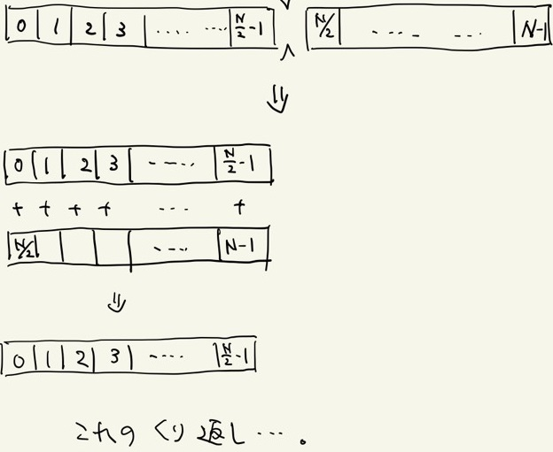
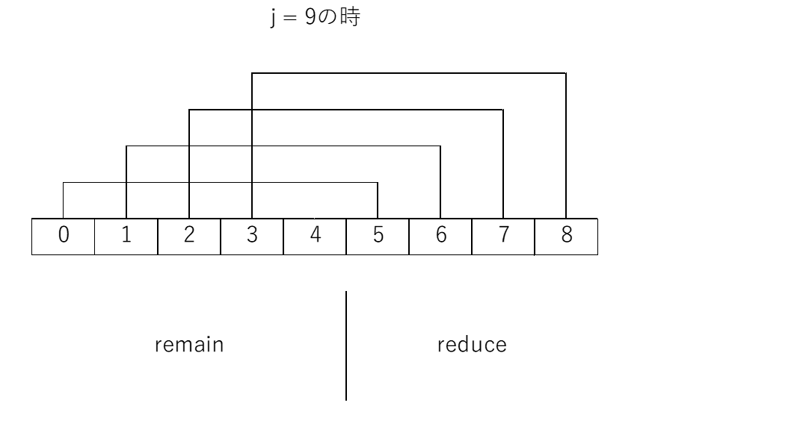

# 5.2 畳み込み法
Atomic演算が遅い原因は、1つしかレジのないお店のレジ待ちの客のように、一つのアドレスに複数のスレッドが順番にアクセスしようとしているためだった。
詰まっているレジはレジを複数台用意すれば解決する。
ならば、アクセスするメモリも複数であれば問題なさそうだ。これを総和計算に応用したものが畳み込み法(Reduction)である。

## 5.2.1 発想

畳み込み法では総和を取りたい配列を前半と後半に分け、後半部分を前半部分に足し込むのだ。
これを配列数が1になるまで繰り返すことで総和計算を実現する。
これが配列をパタンパタンと畳んでいくように見えるため、畳み込み法と言う。
この方法を用いることで総和にかかる計算時間を `O(log_2(N))` 程度に抑えることが出来る。



畳み込み法のイメージ

## 5.3.2 実装
配列数が2のべき乗でなかった場合はどうすればよいだろうか。

配列 `arr` の残りの要素数を `j` とする。

`j = remain + reduce (remain > remain)`

となるように `remain` と `reduce` を決める。
この時、`reduce` は `remain` を超えないギリギリの整数にするのが良い。



`j = 9`の時に `remain` と `reduce` を決める様子

そうした後に、 `i(<reduce)` 番目のスレッドが `arr[i] += arr[i+remain]` とする操作を実行すると1回分の畳込みを実現できる。
後は `j = ramain` に更新し、振り出しに戻るのを繰り返せばよい。

これを実際にCUDAで書いたものが以下である。

```cuda
"reduction.cu"

__global__ void addReduction(int *out, int *in, int remain, int reduce){
    int i_global = blockIdx.x * blockDim.x + threadIdx.x;

    out[i_global] = in[i_global];
    if(i_global < reduce){
        out[i_global] += in[i_global + remain];
    }
}

int sum(int *x){
    int sum;

    //Allocate 2 arrs for reduction
    int *x_dev[2];
    cudaMalloc((void**)&x_dev[0], Narr * sizeof(int));
    cudaMalloc((void**)&x_dev[1], Narr * sizeof(int));

    cudaMemcpy(x_dev[0], x, Narr * sizeof(int), cudaMemcpyHostToDevice);

    int remain, reduce;
    int flip = 0;

    //Reduction operation
    for(int len = Narr; len > 1; len -= reduce){
        reduce = len >> 1; //reduce = len / 2
        remain = len - reduce;
        flip = !flip; // 1 == !(0), 0 == !(1)
        addReduction<<<(remain + NT - 1)/NT,NT>>>(x_dev[flip], x_dev[!flip], remain, reduce);
    }

    cudaMemcpy(&sum, x_dev[flip], sizeof(int), cudaMemcpyDeviceToHost);

    cudaFree(&x_dev[0]);
    cudaFree(&x_dev[1]);

    return sum;
}
```
`reduce` を求める際、右シフト演算で1/2を表現している。
C言語では0と`false`, 0以外と`true`は同義なので、否定演算子で畳み込みの配列をスイッチしている。

これでも十分速くなったが、メモリの転送前にGlobalメモリに複数回アクセスしている部分に改善の余地が残されている。
せっかくGPU内でアドレスを使い回す処理があるならば、それをSharedメモリ側で行う方がよりGPUのマシンパワーを引き出すことが出来る。

[次の節](./5.3.md)では実際にSharedメモリを活用して、更に畳み込み法を早くする術を見ていく。

## Links
* [次へ](./5.3.md)
* [前へ](./5.1.md)
* [目次](./index.md)