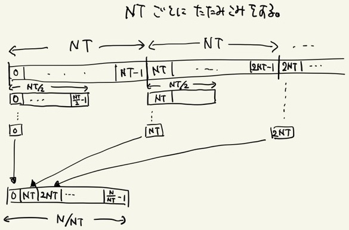

# 5.3 Sharedメモリを活用した高速化
Sharedメモリを活用すると言っても基本的なコンセプトは変わらない。
スレッド数 `NT` 毎に配列をSharedメモリに格納し、そこでそのローカルな配列の要素数が1になるまで畳み込みを行うのだ。



NT毎に畳み込みを繰り返して次の配列を用意するイメージ図

Globalメモリを使用する[前節](./5.2.md)の場合と比較してローカルな畳込みにかかる時間は極めて速く、1回のカーネルの呼び出しで要素数が `1/NT` 程度に減少するため、計算時間を `O(log_NT(N))` 程度に抑えることが出来る。

実際にSharedメモリを活用した畳み込み計算を書いたものが以下である。

```cuda
"reduction_shared.cu"

__global__ void addReduction(int *out, int *in, int len){
    int i_block = blockIdx.x;
    int i_local = threadIdx.x;
    int i_global = i_block * blockDim.x + i_local;

    //Allocate Shared mem
    __shared__ int f[NT];

    if(i_global < len){
        //Transfer values from Global mem to Shared mem
        f[i_local] = in[i_global];
    }
    __syncthreads();

    //local reductions
    int remain, reduce;
    for(int j = NT; j > 1; j = remain){
        reduce = j >> 1;
        remain = j - reduce;
        if(i_local < reduce && i_global + remain < len){
            f[i_local] += f[i_local+remain];
        }
    __syncthreads();
    }

    //Transfer values from Shared mem to Global mem
    if(i_local == 0){
        out[i_block] = f[0];
    }
}

int sum(int *x){

    ...

    //Reduction operation
    int remain;
    int flip = 0;
    for(int len = Narr; len > 1; len = remain){
        remain = (len+NT-1)/NT;
        flip = !flip;
        addReduction<<<remain,NT>>>(x_dev[flip], x_dev[!flip], len);
    }

    ...

}
```
Sharedメモリへの書き込みや1回のローカルな畳込み終了時のように、ブロック内スレッド間で同期をとる必要がある部分で `__syncthreads()` を呼んでいる。
ブロック内同期をとる際にはその都度待機が入るため、不用意に呼ぶと動作が遅くなる点に注意する。

また、[前節](./5.2.md)でも何度もメモリへのアクセスを行っているため、同期が必要だと思う人もいるかも知れないが、カーネルとカーネルの間では暗黙的に同期処理が入るため、その心配いらない。

少々複雑だが、これで更に高速な畳込みが可能となった。

## Links
* [次へ](./5.4.md)
* [前へ](./5.2.md)
* [目次](./index.md)