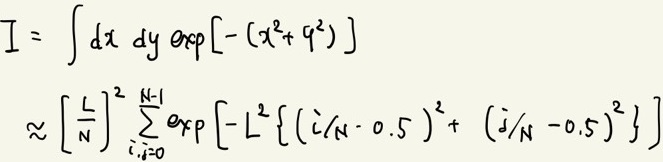

# 5.4 章末課題 
## 問1 atomic計算
Atomic演算を活用して総和計算を行い、性能をCPUでの逐次処理と比較・評価せよ。
また、この結果やAtomic演算の性質を踏まえ、どのような場面でAtomic演算を活用すべきか考えよ。

## 問2 畳み込み計算
CPUによる逐次処理、[5.2節](./5.2.md)の畳み込み計算、[5.3節](./5.3.md)の畳み込み計算を様々な `Narr` について実行し、性能を比較・評価せよ。

## 問3 ガウス積分
2次元ガウス積分

を台形近似で数値積分せよ。

## Links
* [次へ](./5.5.md)
* [前へ](./5.3.md)
* [目次](./index.md)