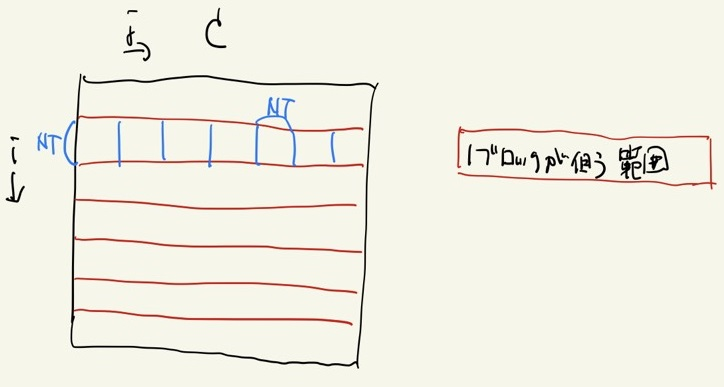

# 6.1 並列化
## 6.1.1 2次元的な並列化
並列化にあたって、C_ijのiにもjにも独立に並列化してもよいが、キャッシュヒット率の観点から、次のように並列化する。

1. i成分をx成分のスレッド数毎に分割し、そのひとまとまりをブロックとする。
1. ブロックのj成分をy成分のスレッド数毎に分割する。



このようにして区切った上図の青い四角を1回の計算単位として行列積を行う。

並列化にあたって、CUDAは3次元までであればその区切り方を　`dim3`　という構造体で指定できる[[1]]ので、それを活用すると、行列積は以下のように書ける。

```cuda
"matmat-mul.cu"

...

const int Nmat = 1000;
const int NT = 32;
const int NB = (Nmat + NT - 1)/NT;

...

__global__ void glo_matmatMul(int *c_dev, int *a_dev, int *b_dev){
    int i_global = blockIdx.x * blockDim.x + threadIdx.x;
    int j_global = threadIdx.y;

    int c_ij;
    if(i_global < Nmat){
        for(int j = j_global; j < Nmat; j += NT){
            c_ij = 0;
            for(int k = 0; k < Nmat; k++){
                c_ij += a_dev[i_global*Nmat + k] * b_dev[k*Nmat + j];
            }
            c_dev[i_global*Nmat + j] = c_ij;
        }
    }
}

void matmatMul(int *c, int *a, int *b){
    dim3 dimThreads(NT, NT, 1);

    int *a_dev, *b_dev, *c_dev;
    cudaMalloc((void**)&a_dev, Nmat * Nmat * sizeof(int));
    cudaMalloc((void**)&b_dev, Nmat * Nmat * sizeof(int));
    cudaMalloc((void**)&c_dev, Nmat * Nmat * sizeof(int));
    cudaMemcpy(a_dev, a, Nmat * Nmat * sizeof(int), cudaMemcpyHostToDevice);
    cudaMemcpy(b_dev, b, Nmat * Nmat * sizeof(int), cudaMemcpyHostToDevice);

    // C = A × B
    glo_matmatMul<<<NB,dimThreads>>>(c_dev, a_dev, b_dev);

    cudaMemcpy(c, c_dev, Nmat * Nmat * sizeof(int), cudaMemcpyDeviceToHost);
    return;
}
```
今回 `NT = 32` としているが、これは1成分のスレッド数であり、今回は2成分で並列化しているため、実際生成されるスレッド数は1024である点に注意する。

## 6.1.2 Sharedメモリの活用
せっかくキャッシュヒット率の観点で並列化する際の区切り方を決めたならば、ちゃんとSharedメモリを活用したくなる。
特に上図のブロックの帯をみると、青四角の領域を計算するために行列A, Bの特定の領域に複数回メモリのアクセスがあることに気づく。
その部分を予めSharedメモリに入れておけば、さらなる高速化ができそうだ。

複数回メモリのアクセスがある部分をSharedメモリに入れる処理を施したものが以下である。

```cuda
__global__ void glo_matmatMul(int *c_dev, int *a_dev, int *b_dev){
    int i_block = blockIdx.x * blockDim.x;
    int i_local = threadIdx.x;
    int i_global = i_block + i_local;
    int j_local = threadIdx.y;
    int j_global;

    __shared__ int a[NT*NT], b[NT*NT];
    int c_ij, a_ij, b_ij;

    for(int j_block = 0; j_block < Nmat; j_block += NT){
        j_global = j_block + j_local;
        c_ij = 0;
        for(int k_block = 0; k_block < Nmat; k_block += NT){
            //Load local matrices from global mem
            a_ij = 0;
            b_ij = 0;
            if(i_global < Nmat && k_block + j_local < Nmat){
                a_ij = a_dev[i_global*Nmat + k_block+j_local];
            }
            if(j_global < Nmat && k_block + i_local < Nmat){
                b_ij = b_dev[(k_block + i_local)*Nmat + j_global];
            }
            a[NT * i_local + j_local] = a_ij;
            b[NT * i_local + j_local] = b_ij;
            __syncthreads();
            for(int k_local = 0; k_local < NT; k_local++){
                c_ij += a[NT * i_local + k_local] * b[NT * k_local + j_local];
            }
            __syncthreads();
        }
        if(i_global < Nmat && j_global < Nmat){
            c_dev[i_global*Nmat + j_global] = c_ij;
        }
    }
}
```

大きな行列をNT×NTの小行列毎に区切って計算していることに注目してほしい。

## Links
* [次へ](./6.2.md)
* [前へ](./6.0.md)
* [目次](./index.md)

## 引用、紹介
[[1]] [GPUによる並列計算とCUDA C プログラミング概要][1]

[1]: https://www.google.com/url?sa=t&rct=j&q=&esrc=s&source=web&cd=&cad=rja&uact=8&ved=2ahUKEwiKvZXt-cLqAhUczYsBHeRCDQEQFjADegQIBBAB&url=http%3A%2F%2Fwww.ocw.titech.ac.jp%2Findex.php%3Fmodule%3DGeneral%26action%3DDownLoad%26file%3D20131226717065-469-0-15.pdf%26type%3Dcal%26JWC%3D20131226717065&usg=AOvVaw1i2pNE9kKpYIc5F0WnK2oR