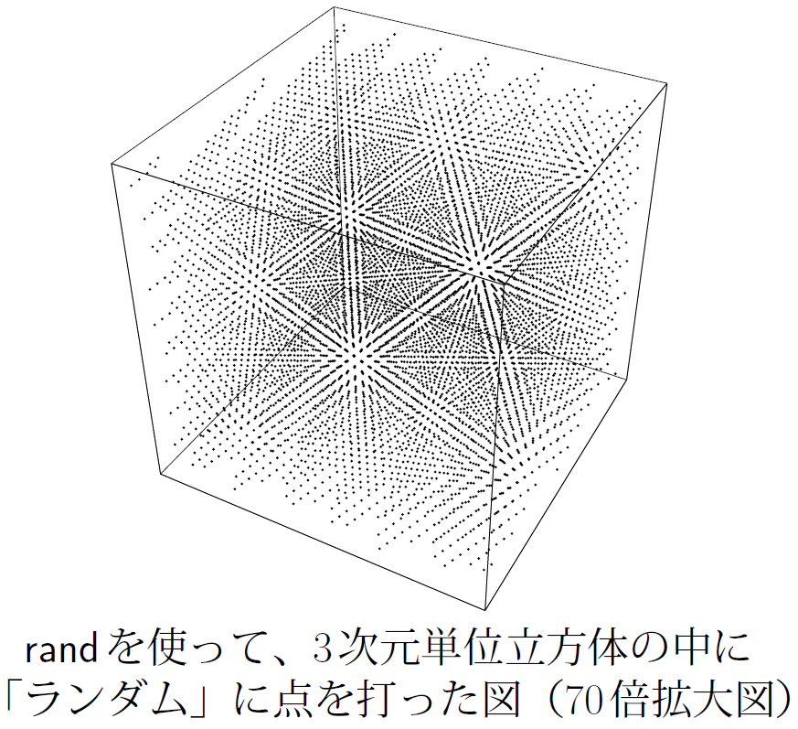

# 7.1 逐次での疑似乱数生成
並列での乱数生成の前に逐次で標準的な疑似乱数を紹介する。

## 7.1.1 線形合同法
C言語のrand()は線形合同法を採用している。
初期値xについて

```cpp
int rand(int *x){
    int A = (大きな素数);
    int B = (大きな素数 != A);
    *x = A * *x + B;
    return *x;
}
```

という手続きで乱数を生成する。
xはオーバーフローを起こすと下32bitを残して切り捨てる。
極めて簡単な実装でそれらしい振る舞いをしてくれるが、多くの問題点がある。


まず、周期が短いことだ。int32型での周期は最大2^32で、シミュレーションで容易に1周できる。
その上、小さい桁の乱数性が低く、必ず偶数と奇数を交互に繰り返してしまう。
(バンダイナムコ発売の[ガルドセプト サーガ](https://www.culdcept.com/series/culdcept_saga/)にてダイスの目が偶数か奇数か予測出来るバグ[[1]]の原因がおそらくこれ)
さらに多次元にて秩序が見られる[[2]]。



[間違いだらけの疑似乱数選び][2][[2]]より引用

## 7.1.2 Mersenne-Twister
線形合同法での様々な問題点を解決するのがMersenne-Twister[[3]]である。
アルゴリズムの詳細は省くが、これを用いて適切なパラメーターを指定することで、計算速度は線形合同法と大差ないにも関わらず、周期が2^19937-1となり、高次元均等分布を実現する(623次元超立方体中に均等に分布することが示されている)。
これがいわゆるMT19937で、一般的にMersenne-Twisterによる疑似乱数と呼ぶ時、MT19937を指す。
MT19937のアルゴリズムはホームページからダウンロードが出来る他、C++11以降の標準ライブラリ`<random>`に採用されている。

## Links
* [次へ](./7.2.md)
* [前へ](./7.0.md)
* [目次](./index.md)

## 引用、紹介
[[1]] [Culdcept Saga (Fake Dice)][1]
[[2]] [間違いだらけの疑似乱数選び][2]
[[3]] [Mersenne　Twister Home Page][3]

[1]: https://www.youtube.com/watch?v=TGMV8s8TtJY
[2]: http://www.soi.wide.ad.jp/class/20010000/slides/03/sfc2002.pdf
[3]: http://www.math.sci.hiroshima-u.ac.jp/~m-mat/MT/mt.html