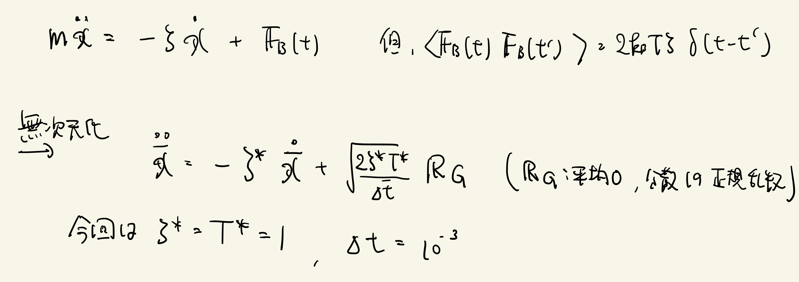

# 8.2 拡散運動
以下のLangevin方程式に従って動く2次元のブラウン運動を統計的に見たい。

周期境界条件を満たす1辺L=10の正方形の箱の中央(x, y) = (5, 5)に以下のLangevin方程式に従う相互作用しないブラウン粒子100万粒を置き、時間発展させる。

N=256として箱をN×Nに分割し、それぞれの箱に入っている粒子数を適当な時間ステップごとにプロットせよ。

## Links
* [次へ](./8.3.md)
* [前へ](./8.1.md)
* [目次](./index.md)