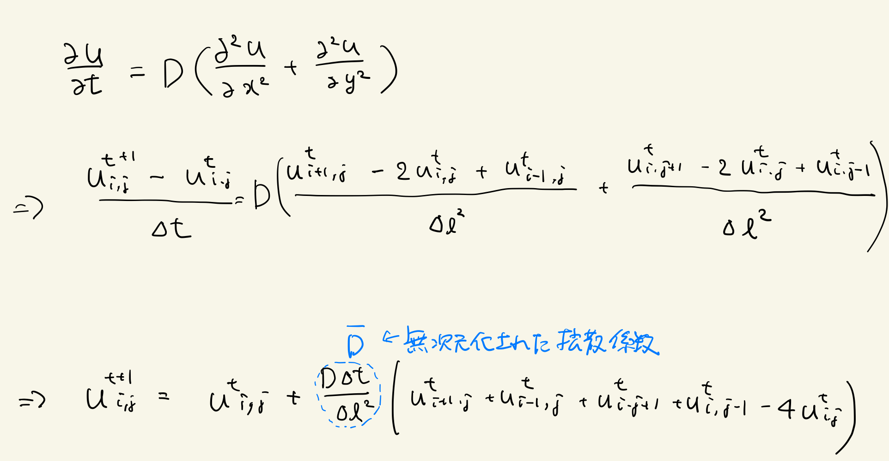

# 8.3 拡散方程式
拡散方程式は前進時間中心差分スキームで以下のように離散化出来る。

一辺L=10の正方領域をN=256としてN×Nに分割し、以下の条件で拡散方程式を数値的に解き、適当なステップ毎にuをプロットせよ。

「条件」
* 周期境界
* 初期値: u_ij = 1.0 (i, j = 127), u_ij = 0 (i, j != 0)
* 無次元化された拡散係数: D = 0.1

## Links
* [次へ](./8.4.md)
* [前へ](./8.2.md)
* [目次](./index.md)