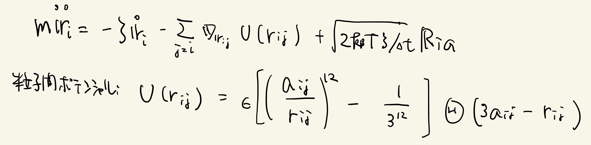

# 8.4 液体の運動
2次元液体の運動を観察したい。

2次元2成分粒子系を考える。
粒子数密度ρ = 0.8、粒径比a1:a2 = 1 : 1.4、粒子数比N1:N2 = 1:1 粒子数N = N1 + N2 = 131072とする。
ある粒子i は次のLangevin方程式に従う。

問1. 位置エネルギーの平均値と運動エネルギーの平均値を100ステップごとにプロットせよ。

問2. k ~ 2pi/a1について、自己中間散乱関数をプロットせよ。

## Links
* 次へ
* [前へ](./8.3.md)
* [目次](./index.md)